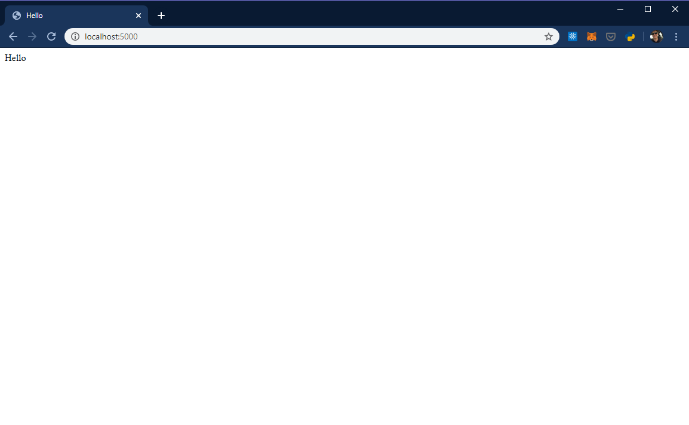

# Selenium Grid Node cannot connect to flask app.

## How to reproduce
Clone the repository.

Build and spin up the docker containers in detached mode.
```powershell
docker-compose up --build -d
```

Run the simple selenium test.
```powershell
docker-compose run app bash -c "pytest test_end_to_end.py --driver Remote --capability browserName chrome --host selenium-hub --live-server-port 5000 --live-server-host 0.0.0.0"
```

### Breaking down command above
1. Run `pytest` in the app container `docker-compose run app bash -c "" pytest ..."`
2. The next piece `test_end_to_end.py` says run that file under test. Our current working directory is `/src` because it is specified at the end of the `src/Dockerfile`
3. The next three options are `--driver Remote --capability browserName chrome --host selenium-hub` these are passed to `pytest-selenium` [setting selenium-grid as the webdriver](https://pytest-selenium.readthedocs.io/en/latest/user_guide.html#selenium-server-grid).
    1. the `--host` option is what tells `pytest-selenium` where to find the grid. Which is set with the container name `selenium-hub` from the `docker-compose.yml`.
4. The last options `--live-server-port 5000 --live-server-host 0.0.0.0` are used by `pytest-flask` to [setup the live_server fixture](https://pytest-flask.readthedocs.io/en/latest/features.html#live-server-application-live-server).
 
 It fails..
 
 
 
## Testing from the Host
The flask site works from the host

